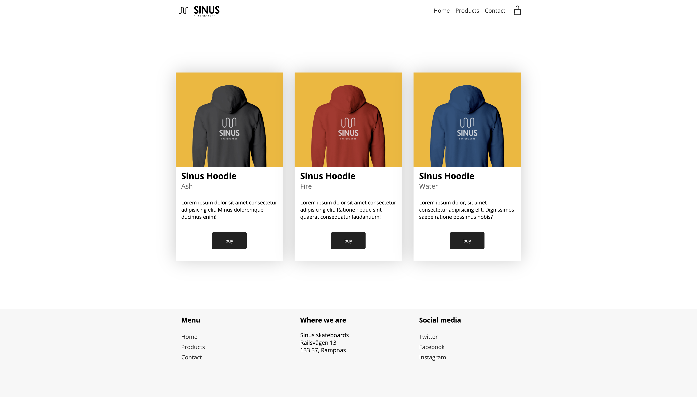
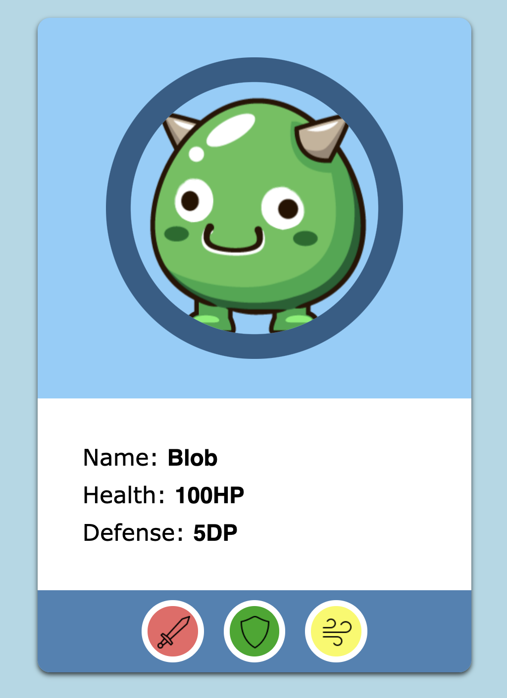
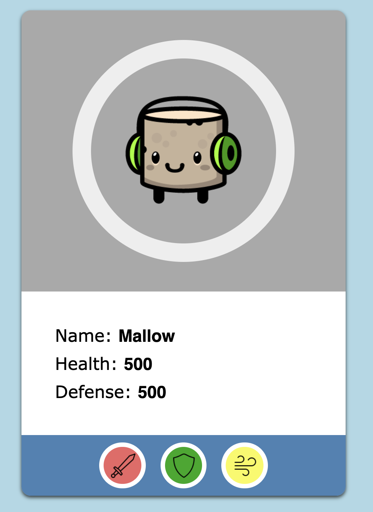
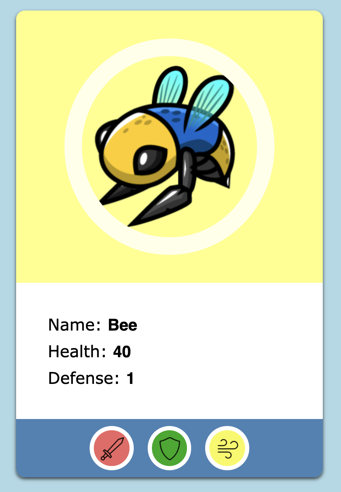

# Sinus Minishop
## Kom igång
Ladda ner sinus minishop. All din kod ska skrivas i *script.js*.
I denna övning kommer du få öva på:

- Leta reda på saker i DOM och ändra innehåll
- Lägga till ny HTML med JS


## DOM Selecta!


**1.** Byt *namn* på första hoodien från *Ash* till *Potato*.

<details>
    <summary>Tips</summary>
    använd .innerText
</details>

**2.** Byt *namn* på *Home* till *Start*.

**3.** Byt *namn* på *Contact* till *Mail Us*.

**4.** Byt ut informationen om *Sinus Hoodie  - Fire*.

**5.** Byt *bakgrundsfärg* och *text* på en knapp.

<details>
    <summary>Tips</summary>
    använd el.style.backgroundColor
</details>

**6.** Byt bakgrundsfärg på någon av produkterna.

**7.** Byt ut adressen på sidan.

**8.** Byt färg på samtliga ```<p>```.
<details>
    <summary>Tips</summary>
    använd .querySelectorAll()
</details>

**9.** Ändra text på samtliga knappar till *add to cart*.

**10.** Lägg till classen *active* på menyalternativet *home*.
<details>
    <summary>Tips</summary>
    använd el.classList.add()
</details>

**11.** Ta bort classen *logo* på logotypen.
<details>
    <summary>Tips</summary>
    använd el.classList.remove()
</details>

## Add Content

**12.** Lägg till ett nytt menyalternativ.

**13.** Lägg till en ny produkt med följande info.

|el|beskrivning|
|---|---|
|img |hoodie-forrest.png|
|h2 | Sinus Hoodie |
|h3 |Forrest|
|p|Lorem ipsum dolor sit amet consectetur adipisicing elit. Saepe, dolores.|

<details>
    <summary>Tips</summary>
    använd el.insertAdjecentHTML('beforeend',...)
</details>

# Monster Generator
Skapa en webbplats som varje gång du laddar sidan visar en slumpad fiende.

Du behöver minst tre funktioner:
* En funktion som genererar en random fiende som ett objekt
* En funktion som skapar HTML-koden för en fiende
* En main-funktion som anropar båda dessa

## Tips
Två bra sätt att börja med såna här problem är att antingen börja i styling eller funktion.
Dvs, antingen får du all javascript att fungera först, sen sminkar.
Eller så gör du en statisk version först och sen lägger på javascript.

## Mocks


